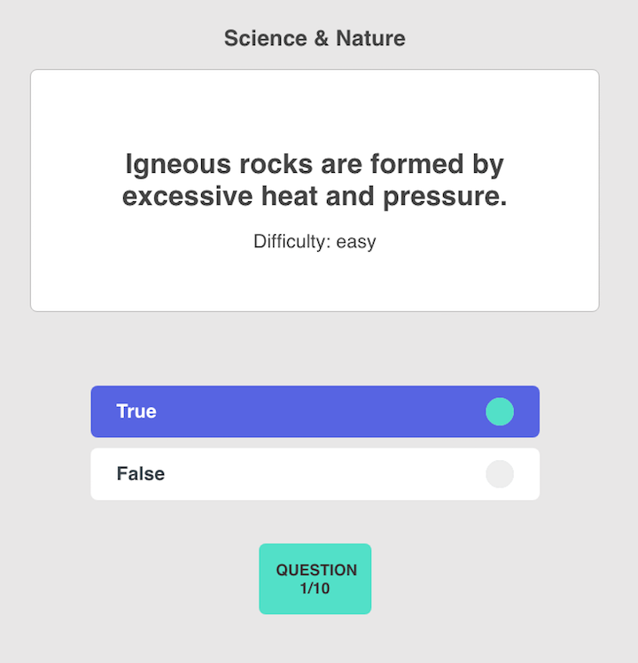

<h1>Simple React Quiz App</h1>

This is a simple quiz app, to demo an example usage of React Hooks and Typescript. React Hooks, stabilized and shipped with React 16.8, are a means to manage state and 'hook' into React Life Cycle Methods within funcitonal components. Hooks are an alternative to frequently used state management libraries like Redux.

To find out more about React Hooks, start here: [React Documentation: Hooks](https://reactjs.org/docs/hooks-intro.html).

To learn more about Typescript, a superset of JavaScript that enables you to turn your JS from weakly typed into strongly typed sytax, go here and start with the documentation: [Typescript homepage](https://www.typescriptlang.org/). Highly recommended.

Here is a screenshot: 

TODO: I'll be implementing React Router. 
